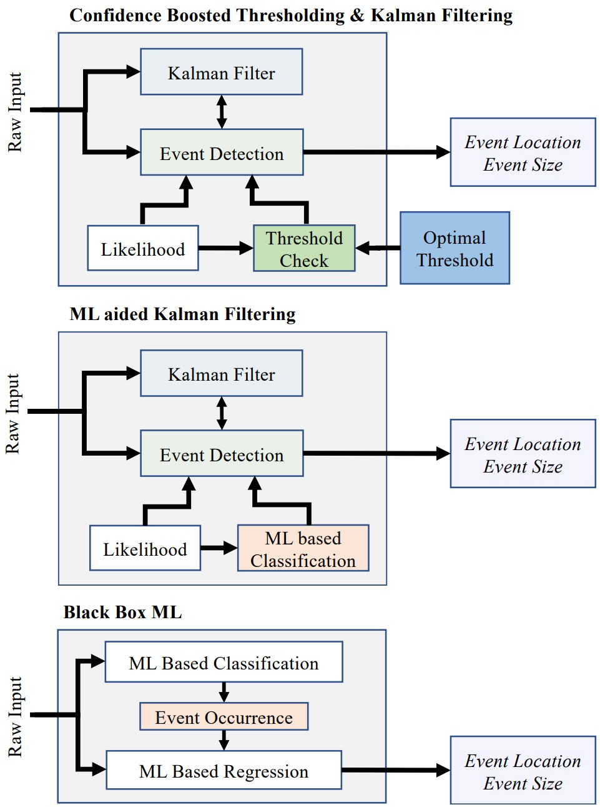

# Nanomechanical-Mass-Spectrometry-ML-KF
## Machine Learning and Kalman Filtering for Nanomechanical Mass Spectrometry

### Authors: Mete Erdogan, Nuri Berke Baytekin, Serhat Emre Coban, Alper Demir

Nanomechanical resonant sensors are used in mass spectrometry via detection of resonance frequency jumps. There is a fundamental trade-off between detection speed and accuracy. Temporal and size resolution are limited by the resonator characteristics and noise. A Kalman filtering technique, augmented with maximum-likelihood estimation, was recently proposed as a Pareto optimal solution. We present enhancements and robust realizations for this technique, including a confidence boosted thresholding approach as well as machine learning for event detection. We describe learning techniques that are based on neural networks and boosted decision trees for temporal location and event size estimation. In the pure learning based approach that discards the Kalman filter, the raw data from the sensor are used in training a model for both location and size prediction. In the alternative approach that augments a Kalman filter, the event likelihood history is used in a binary classifier for event occurrence. Locations and sizes are predicted using maximum-likelihood, followed by a Kalman filter that continually improves the size estimate. We present detailed comparisons of the learning based schemes and the confidence boosted thresholding approach, and demonstrate robust performance for a practical realization.

Please see https://arxiv.org/abs/XXXX.XXXXX for details.  

| 
  
 | 
|:--:| 
| *Demonstrations of Confidence Boosted Thresholding, ML aided Kalman Filtering and Black Box ML methods.* |

- In the directory "threshold_method”, we present Confidence Boosted Thresholding for Kalman Filtering, together with the optimal threshold selection algorithm. 

- In the directory "method_comparison”, we present the comparisons of the Blackbox ML, ML aided Kalman Filtering and Confidence Boosted Thresholding methods for nanomechanical mass spectrometry. This directory includes both MATLAB and Python codes, where the prerequisites are described in the README file inside the directory.

Dependencies:
	
	Matlab:
		-MATLAB 2022b
		-Deep Learning Toolbox
		-Deep Learning Toolbox Converter for TensorFlow Models
		-Ensemble Algorithms/RUSBoost

	Python:
		-Python version: 3.9.1
		-pip version: 22.2.2
		-XGBoost: 1.6.2
		-Tensorflow: 2.9.2
		-ScikitLearn: 0.20.2
		-scipy: 1.7.1
		-joblib: 1.1.1
		-numpy: 1.20.3
		-pandas: 1.3.4

The python libraries can be established on an Anaconda Environment.
The python.exe file should be specified in MATLAB using the below command:

	pyenv('Version','C:\path\to\anacondaenv\python.exe')

The path to the Anaconda Environment is typically "C:\Users\username\anaconda3\envs\envname\python.exe" for a Windows user.
	

